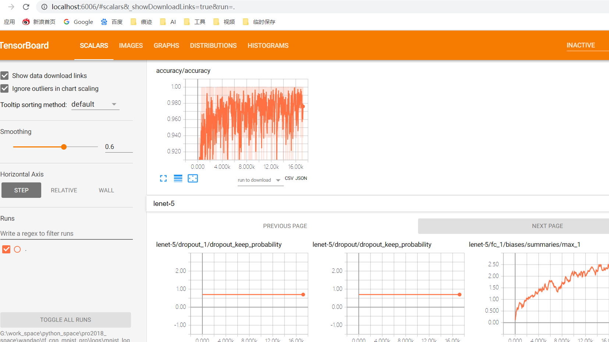
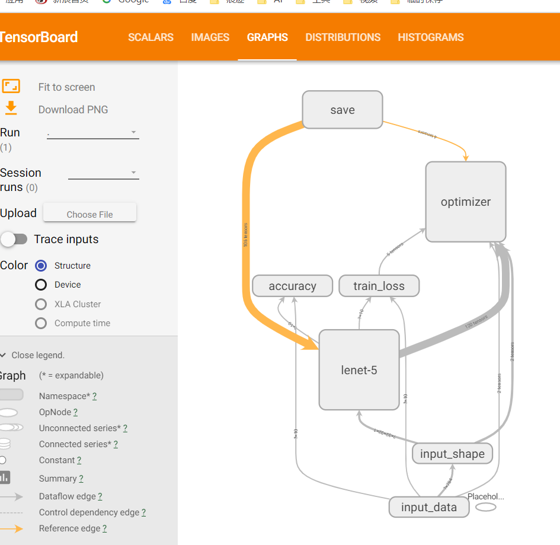

# tf_cnn_mnist_pro
tf_cnn 手写数字预测 2020-02-09
- 项目下载地址：https://github.com/wandaoyi/tf_cnn_mnist_pro
- 请到百度云盘下载项目所需要的训练数据：
- 链接：https://pan.baidu.com/s/13OokGc0h3F5rGrxuSLYj9Q   提取码：qfj6 

## 参数设置
- 在训练或预测之前，我们要先进行参数设置
- 打开 config.py 文件，对其中的参数或路径进行设置。

## 模型
- 模型代码 model_net.py
- 在这里，使用了 lenet-5 网络模型来提取特征

## 训练模型
- 运行 cnn_mnist_train.py ，简单操作，右键直接 run
- 训练效果如下：
- acc_train: 1.0
- epoch: 10, acc_test: 0.984000
- 下面是随意训练的效果，如果想效果好，可以多训练多点epoch
- 也可以自己添加 early-stopping 进去，不麻烦的

## 预测
- 运行 cnn_mnist_test.py ，简单操作，右键直接 run
- 运行后，部分预测结果会打印在控制台上
- 预测效果如下：
- 预测值: [7 2 1 0 4]
- 真实值: [7 2 1 0 4]

## tensorboard 日志
- 使用 tensorboard 的好处是，这个日志是实时的，可以一边训练一边看效果图。
- 在 cmd 命令窗口，输入下面命令：
- tensorboard --logdir=G:\work_space\python_space\pro2018_space\wandao\mnist_pro\logs\mnist_log_train --host=localhost
- 在 --logdir= 后面是日志的文件夹路径，
- 在 --host= 是用来指定 ip 的，如果不写，则只能电脑的地址，而不能使用 localhost
- 在 谷歌浏览器 上打开 tensorboard 日志: http://localhost:6006/

- 模型 acc

- 模型结构

